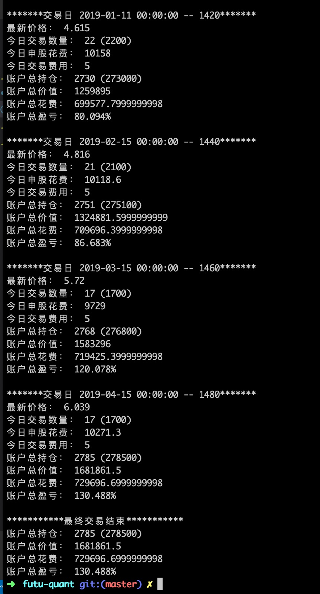
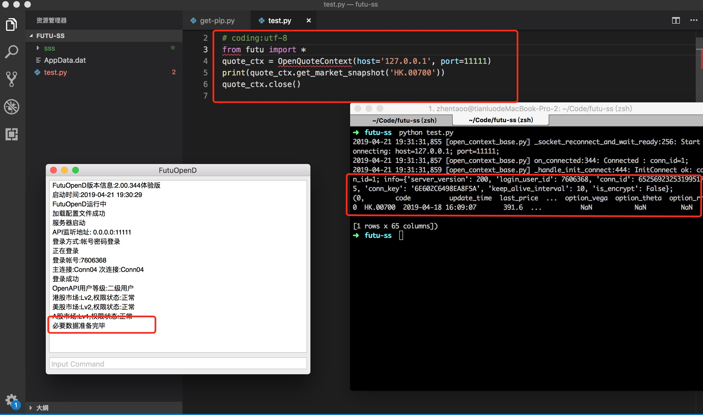

## 使用富途open api，python开启量化之路

### 堆官方文档 & 起步注意事项
- FutuOpenD客户端：https://www.futunn.com/openAPI
- Futu Open API官方文档：https://futunnopen.github.io/futu-api-doc/api/Quote_API.html
- Python官方文档：https://www.python.org/
- 下载FutuOpenD后，记得在xml文件配置自己的账户密码，第一次登录需要去futu官网同意免责协议，还会有一次手机验证码
- 调用过程：写PY脚本，调用futu提供的api（行情、交易），Api Request经过FutuOpenD转发至futu服务器，futu服务器返回数据给py

### 1. 如何获取股票（ETF）历史K线数据
代码如下，使用request_history_kline api可以获取你想要的个股K线数据（其中不包括 5、10、20日均线，需要自己计算）
```python
from futu import *
import pandas as pd

quote_ctx = OpenQuoteContext(host='127.0.0.1', port=11111)

print(data)

ret, data2, page_req_key = quote_ctx.request_history_kline('SH.510050', start='2005-09-30', end='2019-05-05',max_count=1000,page_req_key=page_req_key) #请求开头50个数据
print(data2)
```

### 2. 数据处理，从pandas到json
由于本人更熟悉js，所以用py拿到数据并做了json化之后，用js处理；
对于熟悉python的同学这里应该更加得心应手。


### 3. 策略-定投
配合代码&下图可以看出，从2013-05-01到2019-04-30，每20个交易日定投沪深300，10000元最终可盈利130.488%
<!--  -->


### 4. 策略-均线定投（待续...）


### 最新效果
今天第一次弄，稍微坎坷些，目前只取得了腾讯当前价格，未完待续，欢迎交流、咨询

